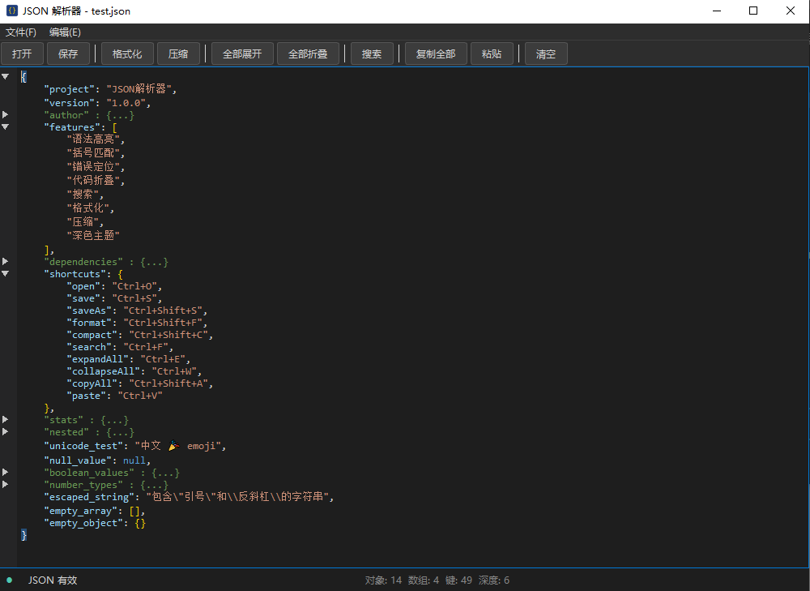

# JSON 解析器

基于 Qt6 + nlohmann/json 的 JSON 解析编辑器桌面工具。



## 功能

- **语法高亮** — 键、字符串、数字、布尔值分色显示
- **括号匹配** — 自动高亮匹配的 `{}` `[]` `()`
- **错误定位** — 解析失败时精确显示错误行/列，并提供修复提示
- **代码折叠** — 抱叠/展开 `{}` 和 `[]`，子折叠状态在父级展开后保持
- **搜索** — Ctrl+F 搜索，支持"全部"列出所有匹配行并跳转
- **格式化/压缩** — Ctrl+Shift+F 格式化，Ctrl+Shift+C 压缩
- **深色主题** — VS Code 风格暗色界面

## 快捷键

| 快捷键 | 功能 |
|---------|------|
| Ctrl+O | 打开文件 |
| Ctrl+S | 保存 |
| Ctrl+Shift+S | 另存为 |
| Ctrl+Shift+F | 格式化 |
| Ctrl+Shift+C | 压缩 |
| Ctrl+F | 搜索 |
| Ctrl+E | 全部展开 |
| Ctrl+W | 全部折叠 |
| Ctrl+Shift+A | 复制全部 |
| Ctrl+V | 粘贴 |
| Esc | 关闭搜索 |

## 构建

依赖：
- Qt 6.5+ (Widgets 模块)
- MSVC 2022 或兼容编译器
- CMake 3.16+

```bash
cmake -B build -G "NMake Makefiles" -DCMAKE_PREFIX_PATH=<Qt路径> -DCMAKE_BUILD_TYPE=Release
cmake --build build
```

构建完成后运行 `windeployqt` 部署 Qt DLL：

```bash
windeployqt build/JsonParser.exe --no-translations --no-opengl-sw
```

## 下载

[最新 Release](https://github.com/dengmik-commits/JsonParser/releases) — 便携版 ZIP，解压后直接运行 `JsonParser.exe`。

## 技术栈

- GUI：Qt 6 (QPlainTextEdit)
- JSON 解析：[nlohmann/json](https://github.com/nlohmann/json) v3.11.3
- 语言：C++17

## 许可

MIT